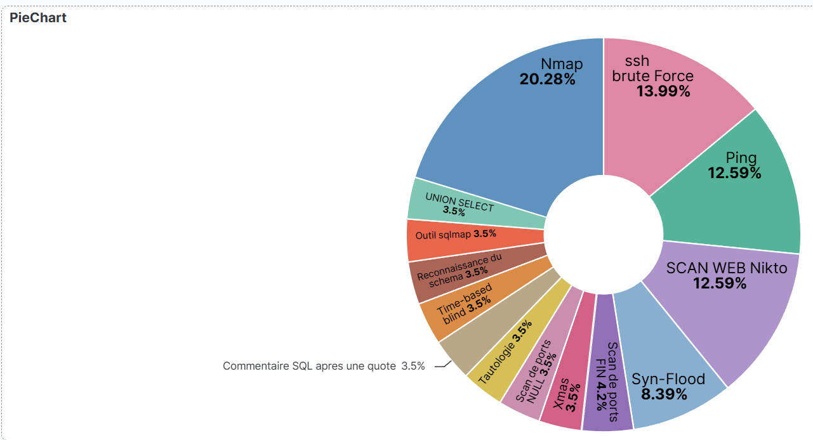

# Guide de Création du Tableau de Bord Kibana (SOC)

Ce guide détaille les étapes pour construire une interface de supervision visuelle dans Kibana, permettant de suivre les attaques dans le temps et de les catégoriser.

## 1. Création de la Chronologie des Attaques (Diagramme en Barres)

Ce graphique (Timeline) permet de visualiser les pics d'activité et d'identifier rapidement le moment exact d'une attaque.

1. Dans le menu principal de Kibana, naviguez vers **Dashboard** et cliquez sur **Create dashboard**.
2. Cliquez sur **Create visualization** pour ajouter un nouveau panneau.
3. Assurez-vous que votre Data View personnalisée (ex. `logs-securite-*`) est sélectionnée dans le menu déroulant en haut à gauche.
4. Dans la liste **Available fields** à gauche, trouvez le champ **`@timestamp`**.
5. Glissez-déposez `@timestamp` directement au centre de l'écran. Kibana générera automatiquement un histogramme (diagramme en barres) représentant le volume de logs dans le temps.
6. Cliquez sur le bouton **Save and return** en haut à droite pour valider ce panneau et le placer sur le tableau de bord.

## 2. Création de la Répartition des Alertes (Diagramme en Camembert)

Puisque le champ texte brut `message` ne peut pas être agrégé automatiquement par Kibana (en l'absence de la version `.keyword`), l'utilisation de la fonction **Filters** permet de découper le camembert manuellement en ciblant les identifiants uniques (SID) des alertes Snort.

1. Depuis votre tableau de bord, cliquez à nouveau sur **Create visualization**.
2. En haut au centre de l'éditeur de graphique, changez le type par défaut pour sélectionner **Donut** ou **Pie**.
3. Dans le panneau de configuration sur la droite, sous la section **Slice by**, ajoutez une dimension et choisissez la fonction **Filters** (au lieu de *Top values*).
4. Créez vos tranches successives en utilisant la syntaxe de requête KQL pour isoler vos règles Snort :
- **Tranche 1 (Détection de Ping) :**
  - KQL : `message: "1000001"`
  - Label : **Ping (ICMP)**
  - *Cliquez sur Add filter pour valider la tranche.*

- **Tranche 2 (Nmap - Scan Classique) :**
  - KQL : `message: "1000002"`
  - Label : **Scan Nmap (Classique)**
  - *Cliquez sur Add filter pour valider la tranche.*

- **Tranche 3 (Nmap - Scan XMAS) :**
  - KQL : `message: "1000008"`
  - Label : **Scan Nmap (XMAS)**
  - *Cliquez sur Add filter pour valider la tranche.*

- **Tranche 4 (Nmap - Scan NULL) :**
  - KQL : `message: "1000009"`
  - Label : **Scan Nmap (NULL)**
  - *Cliquez sur Add filter pour valider la tranche.*

- **Tranche 5 (Nmap - Scan FIN) :**
  - KQL : `message: "1000010"`
  - Label : **Scan Nmap (FIN)**
  - *Cliquez sur Add filter pour valider la tranche.*

- **Tranche 6 (Brute Force SSH) :**
  - KQL : `message: "1000003"`
  - Label : **Brute Force SSH**
  - *Cliquez sur Add filter pour valider la tranche.*

- **Tranche 7 (Injection SQL - Tautologie) :**
  - KQL : `message: "1000011"`
  - Label : **SQLi (OR 1=1)**
  - *Cliquez sur Add filter pour valider la tranche.*

- **Tranche 8 (Injection SQL - Commentaire) :**
  - KQL : `message: "1000012"`
  - Label : **SQLi (Commentaire)**
  - *Cliquez sur Add filter pour valider la tranche.*

- **Tranche 9 (Injection SQL - Time-based) :**
  - KQL : `message: "1000013"`
  - Label : **SQLi (Time-based)**
  - *Cliquez sur Add filter pour valider la tranche.*

- **Tranche 10 (Injection SQL - Reconnaissance) :**
  - KQL : `message: "1000014"`
  - Label : **SQLi (Information Schema)**
  - *Cliquez sur Add filter pour valider la tranche.*

- **Tranche 11 (Injection SQL - Sqlmap) :**
  - KQL : `message: "1000015"`
  - Label : **SQLi (Outil Sqlmap)**
  - *Cliquez sur Add filter pour valider la tranche.*

- **Tranche 12 (Injection SQL - UNION) :**
  - KQL : `message: "1000016"`
  - Label : **SQLi (UNION SELECT)**
  - *Cliquez sur Add filter pour valider la tranche.*

- **Tranche 13 (Détection de DDoS) :**
  - KQL : `message: "1000004"`
  - Label : **DDoS (SYN Flood)**
  - *Cliquez sur Add filter pour valider la tranche.*

- **Tranche 14 (Scan Web Nikto) :**
  - KQL : `message: "1000005"`
  - Label : **Scan Web (Nikto)**
  - *Cliquez sur Add filter pour valider la tranche.*
    

5. Cliquez sur le bouton **Close** du menu des filtres, puis sur **Save and return** pour ajouter le camembert finalisé.

6. Ajustez la taille et la disposition de vos graphiques, puis sauvegardez votre travail en cliquant sur le bouton global **Save** en haut à droite de l'écran.

---
**[Retour au README](../../README.md)**