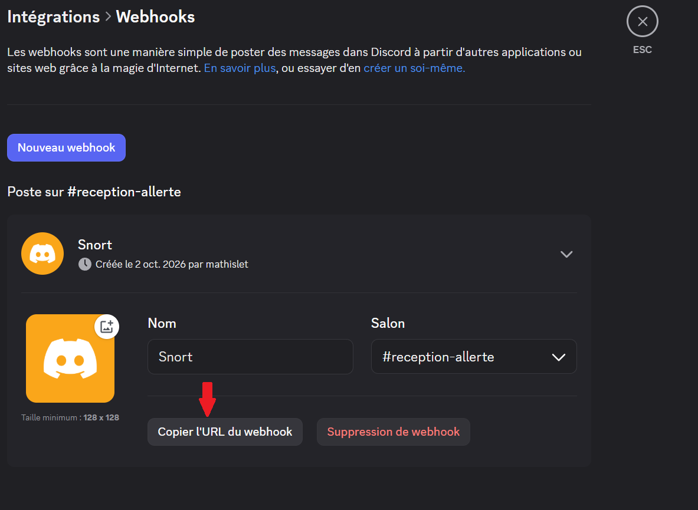
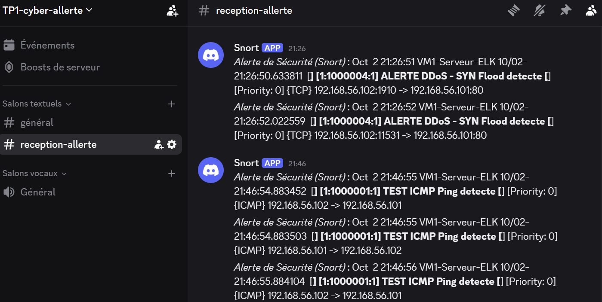

# Configuration des alertes Snort vers Discord
## 1. Récupération de l'url discord

**1.1** Crée un serveur Discord.

**1.2** Crée un Webhook

Il faut ce rendre dans les Paramètres du ``serveur > Intégrations > Webhooks`` et crée un nouveau Webhook.

**1.3** Copier l'URL générée.



## 2. Création du script d'alerte (Bash)

Le script agit comme un pont entre le collecteur de logs système et l'API de Discord. Il réceptionne le log brut, nettoie les caractères problématiques et le formate dans un objet JSON compatible avec les exigences de Discord.

### Création du fichier d'exécution

Créez le fichier suivant :

```bash
sudo nano /usr/local/bin/alerte_sec.sh
```

### Contenu du script

Insérez le code suivant en remplaçant l'URL par celle de votre Webhook Discord :

```bash
#!/bin/bash

# URL du Webhook Discord
WEBHOOK_URL="URL_CANAL_DISCORD"

# Lecture des logs envoyés par syslog-ng ligne par ligne
while read MESSAGE; do

    # Nettoyage des guillemets pour préserver l'intégrité du format JSON
    CLEAN_MSG=$(echo "$MESSAGE" | tr -d '"' | tr -d "'")

    # Formatage de la charge utile (Discord exige l'utilisation de la clé "content")
    PAYLOAD="{\"content\": \"*Alerte de Sécurité (Snort)* : $CLEAN_MSG\"}"

    # Envoi de la requête HTTP POST avec le chemin absolu de curl
    /usr/bin/curl -s -X POST -H 'Content-type: application/json' --data "$PAYLOAD" "$WEBHOOK_URL"

done
```
Vous pouvez trouver le script en fichier dans `/CONF/alerte_discord/alerte_sec.sh`

Rendez ensuite le script exécutable par le système :

```bash
sudo chmod +x /usr/local/bin/alerte_sec.sh
```

---

## 3. Configuration du collecteur Syslog-ng

Il faut déclarer le script comme une nouvelle destination et créer un filtre pour n'envoyer que les alertes pertinentes à Discord, excluant ainsi le trafic système normal ou les règles Snort par défaut.

### Ouvrir le fichier de configuration principal

```bash
sudo nano /etc/syslog-ng/syslog-ng.conf
```

### Définir la destination du script Bash

Ajoutez la destination suivante, qui pointe vers le script :

```text
destination d_script {

    program("/usr/local/bin/alerte_sec.sh");

};
```

### Définir le filtre (optionel)

Définissez ensuite un filtre pour cibler vos règles Snort personnalisées. Celles-ci possèdent obligatoirement un identifiant (**SID**) dans la plage des millions (nos règles), par exemple `1000001` ou `1000004` :

```text
filter f_regles_perso {

    message("10000");

};
```

---

## 4. Définition du routage et activation

La dernière étape consiste à relier la source de vos logs Snort à la destination du script, en y appliquant le filtre restrictif.

Toujours dans le fichier `/etc/syslog-ng/syslog-ng.conf`, naviguez jusqu'à l'emplacement de vos blocs de routage finaux.

Ajoutez ce bloc de liaison spécifique pour Discord :

```text
log {

    source(s_snort);

    filter(f_regles_perso);

    destination(d_script);

};
```

Ce bloc fonctionne en parallèle de votre bloc principal qui envoie tous les journaux vers Elasticsearch, assurant ainsi que Kibana continue de tout recevoir.

### Redémarrer Syslog-ng

Enregistrez le fichier et redémarrez le service pour activer la nouvelle architecture :

```bash
sudo systemctl restart syslog-ng
```

Dès la remise en route du service, toute nouvelle attaque déclenchant une règle personnalisée dans Snort traversera ce pipeline et sera instantanément publiée sur le canal Discord désigné.



---
**[Retour au README](../../README.md)**