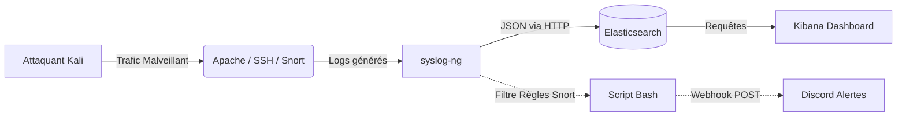

# Projet Pratique : Système de Détection d'Anomalies et Gestion de Logs

Voici le dépôt de notre projet de sécurité des réseaux. L'objectif est de mettre en place une infrastructure complète capable de détecter, collecter et analyser des menaces réseau en temps réel.

## Équipe
- Loan ROHOU
- Dylan MARTY
- Pierre Berteaud
- Mathis Letellier

## Architecture du Projet

Notre infrastructure repose sur la centralisation et l'analyse des logs. Nous utilisons **Snort** comme IDS (détection), **syslog-ng** pour la collecte, et la pile **Elasticsearch/Kibana** pour le stockage et la visualisation.

## Guide d'Installation

Toute la procédure pour déployer l'environnement de bout en bout (IDS, Syslog, ELK) est détaillée ici :
**[Guide d'Installation Pas-à-Pas](INSTALLATION.md)**

## Scénarios d'Intrusion

Nous avons implémenté et testé 5 cas d'intrusion différents. Chaque dossier contient la théorie, les règles de détection, les scripts d'attaque et les captures Kibana prouvant la détection.

1. **[Injection SQL (6 techniques automatisées)](Scénarios/INJ_SQL/README.md)**
2. **[Scan de Ports (Nmap SYN, XMAS, NULL, FIN)](Scénarios/SCAN_PORTS/nmap.md)**
3. **[Brute Force SSH (Hydra + Dictionnaires)](Scénarios/BRUTEFORCE_SSH/brute_force.md)**
4. **[Scan de Vulnérabilités Web (Nikto)](Scénarios/SCAN_Vulnerabilite_Web/Scan_Vulnerabilite_Web.md)**
5. **[Attaque DDoS - SYN Flood (hping3)](Scénarios/SYN_Flood(DDoS)/SYN_Flood.md)**

## Bonus Implémentés

- **[Dashboard Kibana Personnalisé](Bonus/Dashboard/Dashboard.md)** : Vue globale des attaques dans le temps et répartition par type d'alerte pour faciliter le travail de l'administrateur.
- **[Automatisation des Alertes Discord](Bonus/Transmition_alertes_discord/Transmition_alertes_discord.md)** : Script bash couplé à syslog-ng pour envoyer les alertes critiques (règles locales) directement sur un salon Discord.

## Analyse et Conclusion Globale (Veille Technologique)

### Limites du projet actuel
- **Chiffrement (HTTPS) :** Snort analyse le trafic réseau en clair. Si notre serveur web passait en HTTPS, l'IDS réseau serait aveugle au contenu des requêtes (ex: les injections SQL).
- **Faux positifs et contournement :** Les règles basées sur des seuils de temps (Brute Force, Nmap) peuvent rater des attaques "Low and Slow" (très lentes et espacées). À l'inverse, des seuils trop bas génèrent du bruit avec le trafic légitime.
- **Absence de remédiation :** Nous avons monté un IDS (détection uniquement) et non un IPS (prévention). Les requêtes malveillantes atteignent quand même le serveur cible.

### Améliorations possibles & Perspectives
- **Passer de l'IDS à l'IPS :** Configurer Snort en mode "inline" pour bloquer activement les paquets malveillants, ou utiliser **Fail2Ban** en complément pour bannir temporairement les adresses IP offensantes au niveau du pare-feu (UFW).
- **HIDS vs NIDS :** Ajouter un agent de type **Wazuh** (HIDS) sur le serveur. Il pourrait surveiller l'intégrité des fichiers sensibles (FIM) et analyser les logs d'erreurs en complément de l'analyse réseau de Snort, enrichissant ainsi la visibilité dans Kibana.
- **Sécurité Applicative :** Placer un pare-feu applicatif (WAF) comme **ModSecurity** devant le serveur web pour bloquer les failles OWASP directement à la source.
